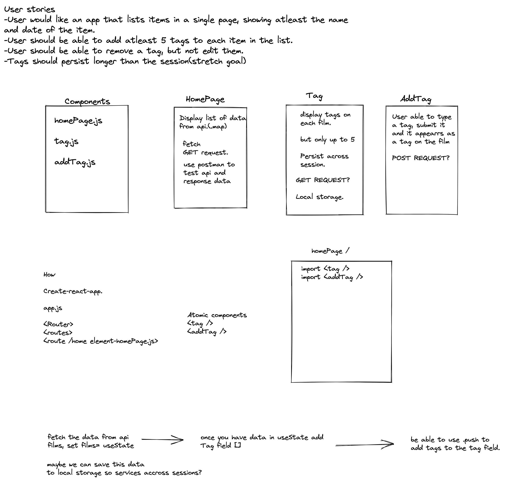

# Sedna Tech Challenge  

- Fetch data from given Api and render it on the page in a list, styled as the design called for. 
- All the user to input up to 5 tags per film, these can be removed but not edited. 
- Allow user to search through films by using tags
- Maintain information accross sessions.

## Plan
- I used excalidraw to spend some time drawing out the compenents and sketch out a rough plan. 
- The link to this can be found here- https://excalidraw.com/#room=c9a09bdb5a7ab88be787,97glCC4W8N3cSn0Z76FSZQ

## Challenges
- Despite given time I was not able to find a solution for searching through tags. 
- I found if i tried to do everything on one page it go messy, but if I tried to split into components I couldn't access the information. 
- I was only given the Api address to be able to do a GET request from. If I was able to make a POST request to change that data in the database i would have found it easier to then loop through the data. This has been the only way I have previously added data. 

## Given more time what would you do?
- There is a second branch called "onePager" where i was trying to explore various solutions. Given more time I would like to achieve the following;
- Use "setItemtoStarage" to be able to save data accross sessions. 
- Add test coverage for what is rendering on the page and the components functionality. 
- Find out a way to take the array of films, add a tags array to each film object, and then be able to search through the tags, inside the film array rather than its own standalone array. 

## Available Scripts

In the project directory, you can run:

### `npm start`

Runs the app in the development mode.\
Open [http://localhost:3000](http://localhost:3000) to view it in your browser.

The page will reload when you make changes.\
You may also see any lint errors in the console.

### `npm test`

Launches the test runner in the interactive watch mode.\
See the section about [running tests](https://facebook.github.io/create-react-app/docs/running-tests) for more information.

### `npm run build`

Builds the app for production to the `build` folder.\
It correctly bundles React in production mode and optimizes the build for the best performance.

The build is minified and the filenames include the hashes.\
Your app is ready to be deployed!

See the section about [deployment](https://facebook.github.io/create-react-app/docs/deployment) for more information.

### `npm run eject`

**Note: this is a one-way operation. Once you `eject`, you can't go back!**

If you aren't satisfied with the build tool and configuration choices, you can `eject` at any time. This command will remove the single build dependency from your project.

Instead, it will copy all the configuration files and the transitive dependencies (webpack, Babel, ESLint, etc) right into your project so you have full control over them. All of the commands except `eject` will still work, but they will point to the copied scripts so you can tweak them. At this point you're on your own.

You don't have to ever use `eject`. The curated feature set is suitable for small and middle deployments, and you shouldn't feel obligated to use this feature. However we understand that this tool wouldn't be useful if you couldn't customize it when you are ready for it.

## Learn More

You can learn more in the [Create React App documentation](https://facebook.github.io/create-react-app/docs/getting-started).

To learn React, check out the [React documentation](https://reactjs.org/).

### Code Splitting

This section has moved here: [https://facebook.github.io/create-react-app/docs/code-splitting](https://facebook.github.io/create-react-app/docs/code-splitting)

### Analyzing the Bundle Size

This section has moved here: [https://facebook.github.io/create-react-app/docs/analyzing-the-bundle-size](https://facebook.github.io/create-react-app/docs/analyzing-the-bundle-size)

### Making a Progressive Web App

This section has moved here: [https://facebook.github.io/create-react-app/docs/making-a-progressive-web-app](https://facebook.github.io/create-react-app/docs/making-a-progressive-web-app)

### Advanced Configuration

This section has moved here: [https://facebook.github.io/create-react-app/docs/advanced-configuration](https://facebook.github.io/create-react-app/docs/advanced-configuration)

### Deployment

This section has moved here: [https://facebook.github.io/create-react-app/docs/deployment](https://facebook.github.io/create-react-app/docs/deployment)

### `npm run build` fails to minify

This section has moved here: [https://facebook.github.io/create-react-app/docs/troubleshooting#npm-run-build-fails-to-minify](https://facebook.github.io/create-react-app/docs/troubleshooting#npm-run-build-fails-to-minify)
